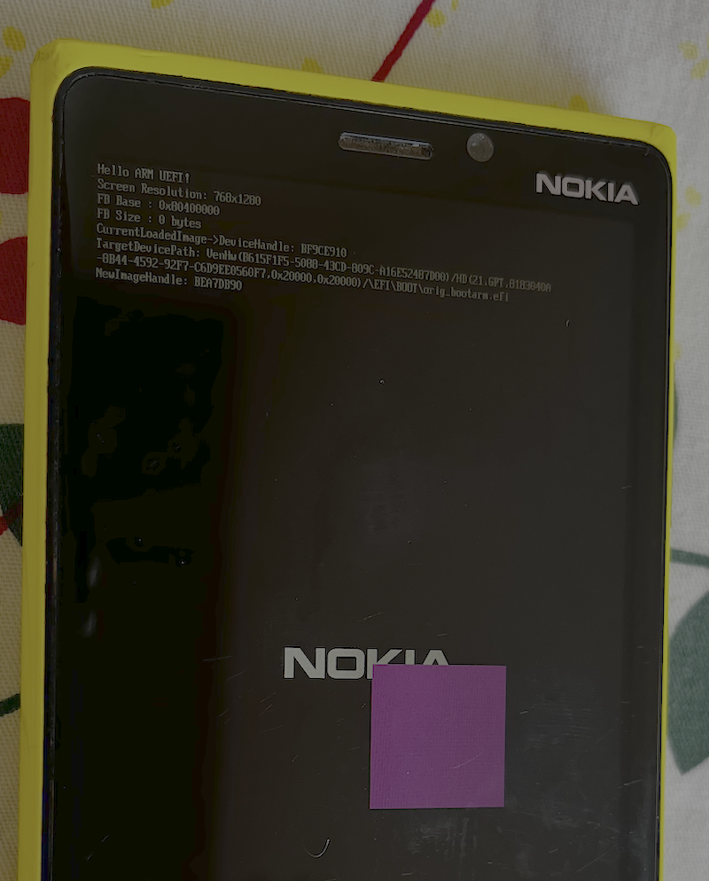
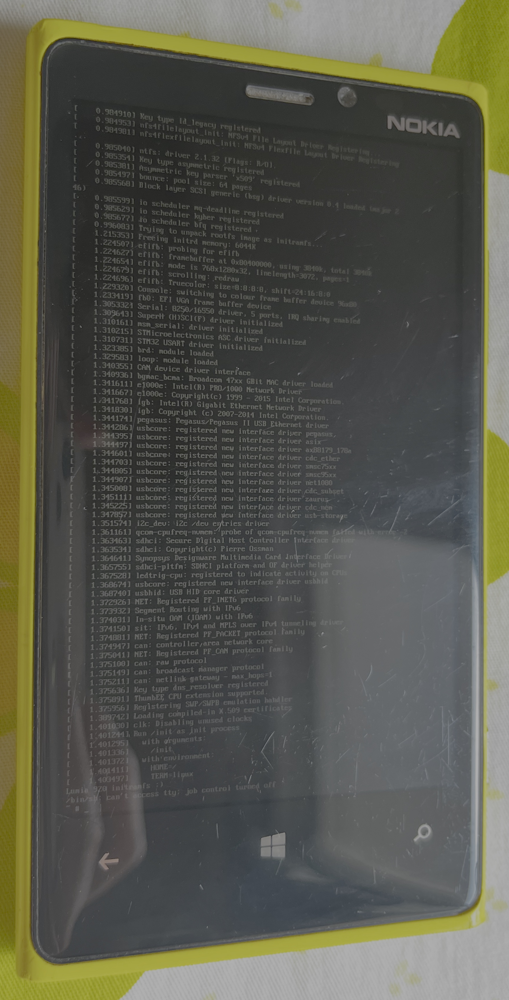

# Lumia Toy

DISCLAIMER:

```
This project is for educational and research purposes only.
Do not use this project for any malicious activities.
Do not use this project for commercial purposes.
The author is not responsible for any damage caused by the use of this project.
```

## Idea

Wana an `Embedded System` Phone Toy?

U might heard about `HTC HD2`, `iPhone 3G/4/4s/5 (checkm8)`, `iPhone 5s - X(checkm8)`, `Pinephone (Linux)`, `Sony Xperia (bootloader unlock)`, etc

BUT, u may just ignored that `Lumia WP8` series!

Since `WPInternals` Team figured out how to unlock lumia bootloader, you can run customized code on them, or even run `Linux` if you'd like to `workaround`

## Lumia 920 Background

I wana to focus on `Lumia 920 (MSM8960)` since it's classic and cheap nowadays, and it has a `4.5 inch screen`

Bootchain:

```
PBL -> SBL1 -> SBL2 -> SBL3 -> UEFI -> Windows Boot Loader -> ntoskrnl
```

Intergity Validation:

```
PBL chk SBL1
SBL1 chk SBL2 (can be bypassed by special eMMC flags)
SBL2 chk SBL3
SBL3 chk UEFI
UEFI chk EFI/Boot/bootarm.efi
```

## Unlock Bootloader

Carefully read the `WPInternals` [source code](https://github.com/ReneLergner/WPinternals), specially the `ViewModels/LumiaUnlockBootloaderViewModel.cs` and `WPinternals/Models/SBL1.cs`, you can find lots of interesting tricks here.

Here's the brief steps:

- Step 0: Trick the phone enter 9008 mode. There are many ways to do this:

    - Use `SoftBrick`: WPInternals did that. Send FFU Header first, and send a blank chunk then, it will override `GPT` and some critical partitions. After reboot, it will enter 9008 mode.
    - Short the `EDL Test Point` or `eMMC CMD Pin` to `GND`
    - Short the `USB D+ Pin` to `GND` (I haven't tried this)

- Step 1: Send the correct programmer to the phone based on its `Root Key Hash`. Lumia 920 using `FAST8960_RMxxx.hex`, so it is likely `fast download` protocal. The loader has `QHSUSB_ARMPRG` string marked it as `v1`. `v1` doesn't chk signature so we can write anything to eMMC.

- Step 2: Trick `SBL1` to accept our unsigned `SBL2`. That is the most interesting part. See `GenerateExtraSector` func in `SBL1.cs` for details.

- Step 3: Patch `SBL2` to `UEFI` chain, disable `Secure Boot` flag in firmware

## Enter 9006 Mass Storage Mode

See `Models/Lumia/UEFI/BootMgr/LumiaBootManagerAppModel.cs` for details.

## Play Baremetal

After unlocking the bootloader, the phone is likely a normal UEFI PC, u can write UEFI apps and run them.

### UEFI memory map:

Conventional Memory:

- 0x80800000 - 0x80C00000
- 0x81700000 - 0x83EB2000
- 0x84239000 - 0x845B8000
- 0x845BC000 - 0x845C0000
- 0x84601000 - 0x88E00000
- 0x90000000 - 0xBE6CС000
- 0xBE6D5000 - 0xBE849000
- 0xBE8DA000 - ОxBE923000
- 0xBE966000 - 0xBE9A6000
- 0xBEA69000 - 0xBEA7D000
- 0xBFACD000 - 0xBFAD1000
- 0xBFDF7000 - 0xBFDF8000

MMIO:

- 0x500000 - 0x501000
- 0x800000 - 0x801000
- 0x200A000 - 0x200B000
- 0x2A03F000 - 0x2A040000

Framebuf (GOP format = 1):

- 0x80400000 - 0x807C0000



## Play Linux 6.6

Check the following:

- Loader: `edk2_gop_linux_src/main.c`
- Kernel src: `https://github.com/UEFI-code/linux-6.6-lumia920`



### Install `EDK2` for ARM32

chk `config_edk2_arm32.sh` for details.